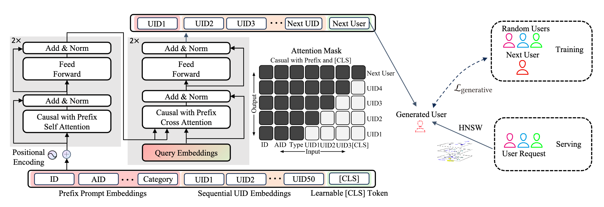

# Next-User Retrieval: Enhancing Cold-Start Recommendations via Generative Next-User Modeling
链接: https://arxiv.org/abs/2506.15267  

1. 要解决什么问题？ 内容冷启  
2. 原先存在什么问题？ 当然是冷启动老生常谈的问题：新内容交互数据太少，曝光和用户的反馈不够  
3. 传统方法咋做的？ 从lookalike人群包的角度切入为新内容寻找反馈，但是会面临两个问题：文章中说的粒度有点粗，我的理解是，传统方法一来缺乏对用户动态行为
和复杂关系的建模能力，只是单纯依赖一些基础特征（如人口统计、兴趣标签）的浅层匹配，二来交互信号利用不足并且多特征融合比较困难  
4. 解决手段是什么？主要是通过生成式建模为每个新物料找到可能交互的用户进行推荐，从而提升内容冷启动的效果。个人感觉整体思路很独特，往常我们都是从
用户的角度来构建物品序列，但这篇文章是从物品的角度出发来构建用户序列。通过transformer来捕捉最近有过互动行为用户之间的单向关系，再利用这些序列来生
成下一个最有可能与项目互动的用户，同时加入内容的前置embedding信息，我理解应该是综合了item的各类静态属性信息，通过文本emb的这类向量模型产出

    
