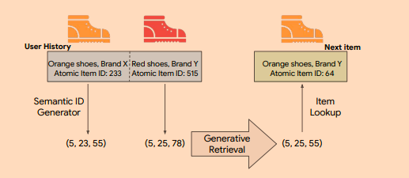
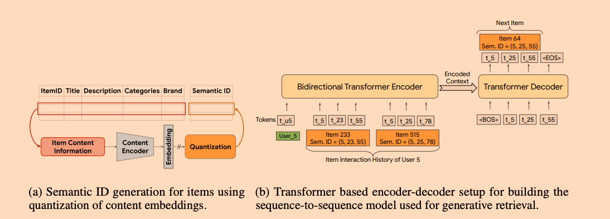
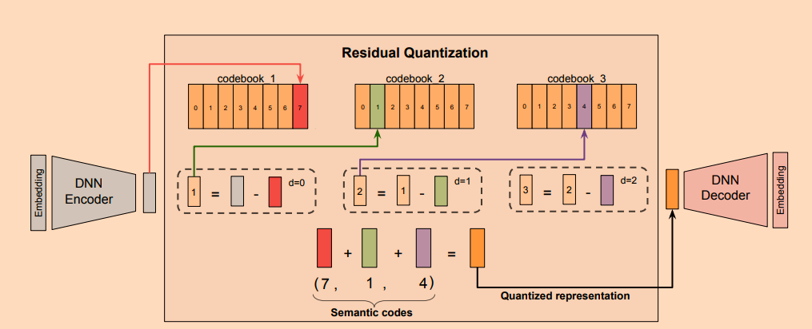

# Recommender Systems with Generative Retrieval  

链接：https://arxiv.org/abs/2305.05065

1. 要解决什么问题？ 
   1. 召回阶段传统方法需要为每个item训练学习一个emb，并构建索引，当item规模达到数十亿时，内存和计算成本高昂  
   2. 新加入的item缺乏和用户的交互，很难被召回到
   3. 多样性不够，点积相似度的召回可能会有流行度偏差的问题，说白了就是召回被头部的热门emb绑架，导致内容缺乏多样性
2. 怎么解决的
   1. 提出了一种新的框架RQ—VAE，为每个item训练学习一个语义ID，后面细说这东西是咋生成，总之这个生成语义ID的优势在于相似物品之间的语义ID会比较接近，
   解决了新内容id扩展这一块的问题，就是说任何item都可以通过RQ-VAE得到一个语义ID
   2. 之后按用户行为时间序列组装语义ID序列，来训练一个Transformer模型，自回归的预测用户下一个可能交互物品的语义ID，替换了传统的emb匹配和相似检索的过程
3. 我的问题
   1. 传统的方式将模型训练和召回剥离开来，上线很方便，这里虽然把这两个阶段合并为了一个，但线上请求时自回归的生成方式肯定是要超时的，这东西我理解只能离线召回了之后存储到redis中以KV的形式上线
   2. RQ-VAE生成出来的语义ID在Transformer中是如何构建vocal list的啊？没这个怎么做映射Token化啊？没想通

### 阅读
1. 整体的生成过程如下, 通过将item的各种基础属性信息收集起来，使用文本向量化的模型（论文中用的是Sentence-T5, 768维）将这些信息构建为基础emb，之后通过RQ-VAE来生成每个item的语义ID(文中是个四元组，最后一个位置用于解决冲突)，
再使用Transformer进行next token的自回归预测生成  
     


进一步细化整体结构，a图表示整个量化生成语义ID的过程，b图表示使用Transformer进行序列到序列的生成模型构建


2. RQ-VAE的生成过程  
语义ID的一个基础目的：相似的item应该具有重叠的语义ID(相当于这两者的emb会比较接近)，比如语义ID(10,21,35)的item相比于ID(10,23,32)的item应该更接近ID(10,21,40)的item,
具体由三个组件构成：  
   1. DNN编码器:通过该模块对sentence-T5得到数据做进一步emb编码，文中大小为[512、256、128，32]这里我理解还有降维的作用  
   2. 残差量化器:输出量化表示, 码本中每个向量的维度和编码器的最后一维相同32维，残差结构总过有三级，每一级处理前一级的残差，每一级学习的内容由粗到浅逐步逼近输入，这里我感觉有点Boost的味道，执行过程如下:
      1. **第1级量化**（Level 0）：
         - 输入：编码器输出的初始向量 $r_0$（蓝色条）
         - 操作：在Codebook 1中搜索最近邻向量 $e_{c_0}$（红色条）
         - 输出：码词索引 $c_0$，残差 $r_1 = r_0 - e_{c_0}$
      2. **第2级量化**（Level 1）：
         - 输入：残差 $r_1$
         - 操作：在Codebook 2中搜索最近邻 $e_{c_1}$（绿色条）
         - 输出：码词索引 $c_1$，残差 $r_2 = r_1 - e_{c_1}$
      3. **第3级量化**（Level 2）：
         - 输入：残差 $r_2$
         - 操作：在Codebook 3中搜索最近邻 $e_{c_2}$
         - 输出：码词索引 $c_2$，最终得到语义ID $(c_0, c_1, c_2)$（例如 $(7, 1, 4)$）
   3. DNN解码器：将量化表示再解码回语义emb空间，进入解码器的是所有级码本向量的和
         
   

3. 损失函数构建  
$$
L = L_{recon} + L_{rqvae}
$$
$$ L_{recon} = ||x - \hat{x}||^2 $$
表示最小化输入和解码器输出的均方误差mes，确保量化后的语义ID能够保留原始输入的语义信息
$$ L_{rqvae} = \sum_{d=1}^{m-1} || sg[r_{i}] - e_{c_i} ||^2 + \beta * ||r_i - sg[e_{c_i}]||^2 $$
前一项相当于固定残差$r_d$, 优化码本向量$e_{c_i}$，使其逼近残差分布；后一项相当于固定码本向量$e_{c_i}$，优化编码器输出的残差$r_d$，使其靠近码本向量，$\beta$用于控制两者的平衡，论文中为0.25


4. 对于固定梯度的理解可以先通过一个例子来说明：  
   厨子做菜，菜品数量有限，厨子会做的菜有限，如果无梯度停止，厨子需要让菜的品类来匹配自己可以做的菜，而菜的品类反过来又要求厨子需要改变自己的炒菜风格，这样搞那就是一盘烂菜
   如果有梯度停止，首先第一步固定厨子，从菜品中选出能够适配厨子风格的菜（更新码本），第二版固定菜品，让厨子选到合适的发挥自己厨艺的菜品（更新编码器），如此双向奔赴才能炒出一盘好菜
   这样交替优化的好处在于可以保证整个训练过程的稳定性，避免了梯度冲突导致的震荡


5. 码本的初始化：  
   还是以上面的例子来说，我们控制不了厨子，但是对于提供的菜品其实可以覆盖到各种菜系的核心品种，这样就可以更好的适配厨子
   所以对于码本的初始化，论文中的做法是基于k均值聚类来初始化码本


6. 序列到序列的模型就是基于transformer来做的，从encoder到decoder，没啥多说的


7. 提出的Tiger这个框架可以带来额外两方面的优势：  
   冷启动: 对于新内容即使缺乏用户的行为反馈数据，也可以凭借RQ-VAE预测得到语义ID，再根据前缀匹配来进行检索，
   比如当前序列模型预测得到的前缀为(10,21,\*,\*)那么所有语义ID为（10,21,\*,\*）的物品包括新物品均会被检索到, 
   ```
   举个栗子: 
   假设数据集中新增一款“薄荷味洗发水”（无用户交互记录）：
   1. 语义ID生成：内容特征 → RQ-VAE → 语义ID (7,1,4,2)(7,1,4,2)（假设前三位对应“护发”→“洗发水”→“薄荷”）。
   2. 用户历史序列：用户过去交互：(7,1,3,0)(7,1,3,0)（“椰子味洗发水”）、(7,2,5,1)(7,2,5,1)（“修护护发素”）。
   3. 模型预测：模型可能输出前缀 (7,1,∗)(7,1,∗)（学习到用户偏好“洗发水”类别）。
   4. 冷启动推荐：检索所有前缀匹配 (7,1,∗,∗)(7,1,∗,∗) 的物品，包括新物品 (7,1,4,2)(7,1,4,2)。
      ```

   内容的多样性:
   在解码阶段基于温度的采样来控制模型推理的多样性，【解释一嘴：温度这个参数是通过重塑数据的概率分布来控制内容的多样性 torch.multinomial(probs, num_samples=1)
   ```
   举个栗子：
   (1) 高温（T>1）平滑概率分布，缩小高分和低分码词的差距。高分码词概率降低，低分码词概率相对提升。生成的语义ID可能出现更多低频组合（如冷门品类或属性）。
          * 若原始logits为[5.0, 3.0, 1.0]（对应码词A/B/C），T=2.0时概率：[0.71, 0.21, 0.08]（C的概率从≈0%升至8%）。
   (2) 低温（T<1）锐化概率分布，放大高分码词的优势。最高分码词概率显著增加，其他码词概率接近0。模型保守选择最高分码词，输出确定性高，推荐结果集中于头部物品（如爆款商品）。
          * 相同logits [5.0, 3.0, 1.0]：T=0.5时概率：[0.98, 0.02, 0.00]（几乎只选A）。
   (3) 常温（T=1）标准Softmax，保持模型原始预测分布，平衡相关性与多样性。
      ```
   所以可以采用混合策略，对前缀码词（c0、c1）高温，后缀码词（c2、c3）低温，实现"大类多样，小类精准"


8. 通过计算推荐结果中物品类别的熵来量化内容的多样性，其中:$c$是类别总数,$p_i$是推荐列表Top-K中第$i$类物品的比例。
$$
\text{Entropy@K} = - \sum_{i=1}^{C} p_i \log p_i
$$
   ```
   举个栗子：
   假设在Amazon Beauty数据集中：
   * 类别集合：{洗发水,护发素,发膜,美容仪}{洗发水,护发素,发膜,美容仪}（C=4）。
   * 推荐结果Top-5：洗发水（3次）护发素（1次）美容仪（1次）
   计算过程：
   1. 统计各类比例：
       * p洗发水=3/5=0.6
       * p护发素=1/5=0.2
       * p发膜=0/5=0
       * p美容仪=1/5=0.2
   2. 计算熵：
   Entropy@5=−(0.6log0.6+0.2log0.2+0log0+0.2log0.2)≈1.37
   ```
   Entropy@K越接近最大值，说明推荐结果的类别分布越均匀，多样性越高。