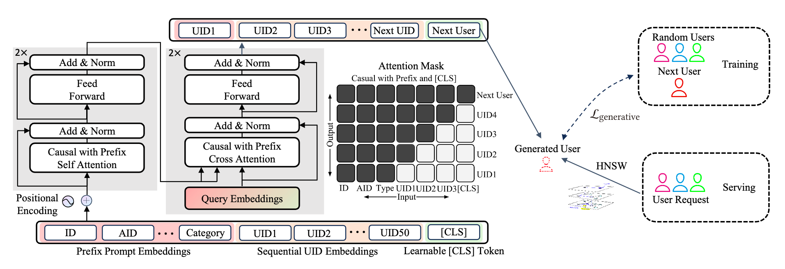

# Next-User Retrieval: Enhancing Cold-Start Recommendations via Generative Next-User Modeling
链接: https://arxiv.org/abs/2506.15267    
### 字节的这篇文章主要是通过生成式建模为每个新物料找到可能交互的用户进行推荐，从而提升内容冷启动的效果。
个人感觉整体思路很独特，往常我们都是从用户的角度来构建物品的序列，但这篇文章是从物品的角度出发来构建用户的序列，自回归的生成每一个可能交互的  
用户同时也会带来基于transformer这类生成式
    
